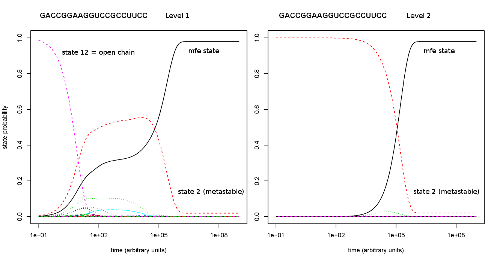

# GeneralizedCoarseGraining

Generalized Coarse Graining (GCG) enables the recursive coarse graining of 
discrete energy landscapes.

# `gcgBarriers.pl`

The Perl5 script `gcgBarriers.pl` computes the gradient-based coarse graining of a
given energy landscape encoding as produced by the 
[`barriers`](https://github.com/ViennaRNA/Barriers) tool when enabling
full rate computation activated by its `--rates` argument.

Usage: `perl gcgBarriers.pl <barriersOutput> <barriersRates>`

### RNA example

The following call set exemplifies the usage of `gcgBarriers.pl` for the RNA secondary
structure energy landscape of riboswitch [boris-1](data/README.md) using the 
[Vienna RNA package](https://github.com/ViennaRNA/ViennaRNA). 
*Note*, the calls are only viable for very short sequences since the whole
accessible structure space / energy landscape is considered. 

```[bash]
# define RNA sequence of interest
RNA=GACCGGAAGGUCCGCCUUCC

# enumerate (and sort) all secondary structures (first by energy using structure string for tie breaking)
echo $RNA | RNAsubopt --deltaEnergy=99999 | sort -k 2,2n -k 1,1dr -S 2G | zip $RNA.RNAsubopt.zip -;

# run barriers to compute coarse graining level 1
unzip -p $RNA.RNAsubopt.zip | barriers --rates -G RNA -M noShift --bsize --max=999999 --minh=0 > $RNA.barriers.out;
# store rate matrix generated by barriers
mv rates.out $RNA.barriers.rates;
# cleanup obsolete barriers files
rm -f rates.bin tree.ps treeR.ps;

(
# get micro-state landscape size
printf "#states level 0 = "; unzip -p $RNA.RNAsubopt.zip | grep -c -v $RNA;
# compute generalized coarse grainings
perl gcgBarriers.pl $RNA.barriers.out $RNA.barriers.rates
)
```

The calls produce the output
```[bash]
#states level 0 = 2993
#states level 1 = 39
#states level 2 = 7
#states level 3 = 1
```
which states the number of macro-states on each coarse graining level.
Furthermore, the following files for each coarse graining level (`LVL`) > 1 are generated:
- `*.LVL.gradient` : appends an additional column to the `barriers` output file of the compressed level (`LVL-1`), which contains the gradient assignment for each local minimum
- `*.LVL.barriers` : a dummy `barriers` output file for the current level
- `*.LVL.rates` : the rates matrix for the current level

Given this data, you can plot the probability time series for the macro-states using
[`treekin`](https://github.com/ViennaRNA/Treekin).
```[bash]
# define variables for the following shell function
FILE="undef"; # base file name without extension (.barriers .rates)
OCID=0; # funnel of open chain state to be taken from according barriers output file
STEPS=1000000000; # maximal time (step) to compute
# shell function (tested in bash) to compute one plot via treekin 
function runTreekin {
 # ensure file naming for treekin call
 ln -s $FILE.rates rates.out;
 # output file prefix 
 OUTFILE=$FILE.treekin.m$OCID
 # call treekin
 treekin -m I --p0 $OCID=1  --t8=$STEPS < $FILE.barriers > $OUTFILE.out; 
 # cleanup temporary files
 rm -f rates.out;
 # generate output figure in pdf format using R
 R --vanilla --silent -e "k <- read.table(\"$OUTFILE.out\", header=F, sep=\"\");pdf(\"$OUTFILE.pdf\");matplot(k[,1], k[,2:ncol(k)], main=\"$OUTFILE\", xlab=\"time (arbitrary units)\", ylab=\"state probability\", ylim=c(0,1), log=\"x\", type=\"l\");dev.off(); q();"
}

# define RNA sequence of interest
# e.g. riboswitch from https://doi.org/10.1002/bip.20761 Fig.7(left)
RNA=GACCGGAAGGUCCGCCUUCC

# level 1 plot
ln -s -f $RNA.barriers.out $RNA.barriers.out.1.barriers
ln -s -f $RNA.barriers.rates $RNA.barriers.out.1.rates
FILE=$RNA.barriers.out.1
OCID=12 # open chain state
runTreekin

# level 2 plot
FILE=$RNA.barriers.out.2
OCID=2 # gradient neighbor of open chain state from level 1
runTreekin

```

which will generate the following figures



